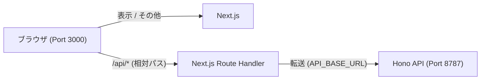

# Next.js + Hono + D1 Monorepo Template

Cloudflare Pages (Next.js) と Cloudflare Workers (Hono) を組み合わせた、実用的なモノレポ構成のテンプレートリポジトリです。

## 🚀 技術スタック

| カテゴリ | 選定技術 | 理由 |
| :--- | :--- | :--- |
| **Framework** | Next.js 16 (App Router) | 高速なレンダリングとSEO、Cloudflare Pagesとの抜群の相性。 |
| **API / Backend** | Hono | Workers/Pages Functionsの標準。RPCによる強力な型安全。 |
| **ORM** | Drizzle ORM | 軽量でTypeScriptの型補完が強力。Edgeランタイムに最適。 |
| **Validation** | Zod | APIの入出力やスキーマ定義を安全に扱える。 |
| **UI Component** | shadcn/ui (Tailwind CSS v4) | Tailwind CSSベースの美しく拡張性の高いUI。 |
| **State Management** | TanStack Query v5 | 非同期通信の管理をシンプルかつ強力に。 |
| **Package Manager** | pnpm (Workspaces) + Turborepo | 高速かつ効率的なモノレポ管理。 |

## 📂 プロジェクト構成

```text
next-hono-d1-template/
├── apps/
│   ├── api/          # Hono (Cloudflare Workers) - バックエンドAPI
│   │   ├── src/index.ts  # APIルート定義、AppType のエクスポート
│   │   └── wrangler.toml # Workers 設定 & D1 バインディング
│   └── web/          # Next.js (App Router) - フロントエンド (Cloudflare Pages)
│       ├── src/
│       │   ├── app/          # App Router ページ・レイアウト
│       │   │   └── api/[[...path]]/route.ts  # API プロキシルート
│       │   ├── components/   # Client Components (UIロジック)
│       │   ├── lib/          # ユーティリティ (api.ts, utils.ts)
│       │   └── providers/    # Context Providers (TanStack Query)
│       └── wrangler.toml     # Pages 設定
├── packages/
│   ├── shared/       # Zodスキーマ、共通の型定義
│   └── db/           # Drizzle ORM スキーマ、マイグレーション、シード
│       ├── src/schema.ts     # テーブル定義
│       ├── drizzle/          # マイグレーションファイル
│       └── scripts/seed.ts   # シードスクリプト
├── package.json      # ルート設定（Turbo, scripts）
├── turbo.json        # Turborepo タスク設定
└── pnpm-workspace.yaml
```

## 🛠 セットアップ & 開発

### 1. 依存関係のインストール

```bash
pnpm install
```

### 2. データベースの準備

```bash
# マイグレーションの適用（ローカルD1）
pnpm db:migrate

# サンプルデータの投入
pnpm db:seed
```

### 3. 開発サーバーの起動

```bash
pnpm dev
```

このコマンドを実行すると、以下の3つのプロセスが同時に立ち上がります。

| ポート | 名前 | 役割 |
| :--- | :--- | :--- |
| **3000** | **Next.js App** | **開発時のメイン入口**。フロントエンド本体と HMR、APIプロキシを提供。 |
| 8787 | Hono API | バックエンド本体（Cloudflare Workers / D1）。 |
| 8888 | Wrangler Pages Proxy | 本番（Cloudflare Pages）の挙動をシミュレートするプロキシ。 |

#### 💡 開発時の重要ポイント: どのURLを開くべきか？

ブラウザでは **[http://localhost:3000](http://localhost:3000)** を開いて開発することを推奨します。



**なぜ 3000 なのか？**
従来は CORS 回避のために Wrangler Proxy (8888) を通す必要がありましたが、現在は Next.js の **Route Handler** (`app/api/[[...path]]/route.ts`) が API プロキシとして機能しています。
ブラウザから `/api/...` という相対パスでリクエストを送ると、Next.js 自身がバックエンド（8787）へデータを橋渡しするため、ポート 3000 だけで **CORS を意識せず、高速な HMR（ホッドリロード）の恩恵を受けながら** 開発が可能です。

### アーキテクチャ: API プロキシパターン

ブラウザからの `/api/*` リクエストは、Next.js Edge Runtime 上の **プロキシルート** (`app/api/[[...path]]/route.ts`) を経由してバックエンド（Hono API）に転送されます。

- **メリット**: CORSを回避、バックエンドURLをクライアントに露出させない
- **ブラウザ側**: `hono/client` で `/api` を起点に型安全なRPCを呼び出し
- **サーバー側**: 環境変数 `API_BASE_URL` でバックエンドURLを指定

## 🗄 データベース (Drizzle / D1)

### スキーマ定義

テーブル定義は `packages/db/src/schema.ts` で管理します。

### マイグレーションの管理

```bash
# マイグレーションファイルの生成（スキーマ変更後）
pnpm db:generate

# ローカルDBへの適用
pnpm db:migrate

# 本番DBへの適用
pnpm db:migrate:remote

# サンプルデータの投入 (ローカル)
pnpm db:seed

# サンプルデータの投入 (本番)
pnpm db:seed:remote
```

### Drizzle Studio

```bash
pnpm -F @next-hono-d1-template/db studio
```

## 🌐 デプロイ

### Cloudflare D1 セットアップ

```bash
# D1データベースの作成
npx wrangler d1 create next-hono-d1-template-db

# 表示された database_id を apps/api/wrangler.toml に設定
```

### Cloudflare Workers (API)

```bash
pnpm api:deploy
```

### Cloudflare Pages (Web)

1. **ビルドコマンド**: `pnpm pages:build`（`apps/web` ディレクトリで実行）
2. **ビルド出力ディレクトリ**: `.vercel/output/static`
3. **環境変数の設定**:
   - `API_BASE_URL`: デプロイされた API (Cloudflare Workers) の URL を設定してください。
   - 例: `https://next-hono-d1-template-api.xxxx.workers.dev`
   - 未設定の場合、ローカル開発用の `http://localhost:8787` が使用されます。
   - **💡 セキュリティ**: `NEXT_PUBLIC_` プレフィックスを付けていないため、この URL はブラウザ側には露出せず、Next.js のプロキシルート（サーバーサイド）でのみ安全に使用されます。

## 💡 特徴: RPCによる型安全な開発

`apps/api` でエクスポートされた `AppType` を `apps/web` で読み込むことで、APIクライアント (`hono/client`) を通じて**ドキュメント不要・型補完あり**の爆速開発が可能です。

```typescript
// apps/web/src/lib/api.ts
import { hc } from "hono/client";
import type { AppType } from "@next-hono-d1-template/api";
const client = hc<AppType>(getBaseUrl());

// 使用例: 型安全な API 呼び出し
const res = await client.hello.$get();
const data = await res.json(); // ← 型が自動で効く！
```

## 📋 コマンド一覧

| コマンド | 説明 |
| :--- | :--- |
| `pnpm dev` | Next.js (3000) + Hono (8787) + Wrangler Proxy (8888) を同時起動 |
| `pnpm build` | 全パッケージのビルド |
| `pnpm lint` | 全パッケージの Lint |
| `pnpm db:generate` | Drizzle マイグレーションファイル生成 |
| `pnpm db:migrate` | ローカル D1 へマイグレーション適用 |
| `pnpm db:migrate:remote` | リモート D1 へマイグレーション適用 |
| `pnpm db:seed` | ローカル D1 へサンプルデータ投入 |
| `pnpm db:seed:remote` | リモート D1 へサンプルデータ投入 |
| `pnpm api:deploy` | Cloudflare Workers に API をデプロイ |
