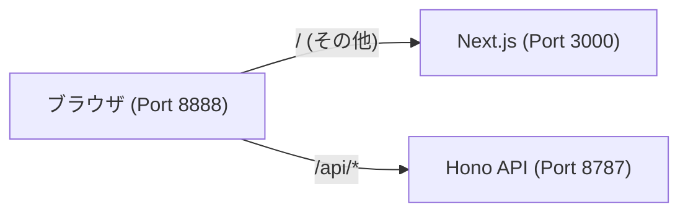

# Next.js + Hono + D1 Monorepo Template

Cloudflare Pages (Next.js) と Cloudflare Workers (Hono) を組み合わせた、実用的なモノレポ構成のテンプレートリポジトリです。

## 🚀 技術スタック

| カテゴリ | 選定技術 | 理由 |
| :--- | :--- | :--- |
| **Framework** | Next.js (App Router) | 高速なレンダリングとSEO、Cloudflare Pagesとの抜群の相性。 |
| **API / Backend** | Hono | Workers/Pages Functionsの標準。RPCによる強力な型安全。 |
| **ORM** | Drizzle ORM | 軽量でTypeScriptの型補完が強力。Edgeランタイムに最適。 |
| **Validation** | Zod | APIの入出力やスキーマ定義を安全に扱える。 |
| **UI Component** | shadcn/ui | Tailwind CSSベースの美しく拡張性の高いUI。 |
| **State Management** | TanStack Query | 非同期通信の管理をシンプルかつ強力に。 |
| **Package Manager** | pnpm (Workspaces) | 高速かつ効率的なモノレポ管理。 |

## 📂 プロジェクト構成

```text
next-hono-d1-template/
├── apps/
│   ├── api/          # Hono (Cloudflare Workers) - バックエンドAPI
│   └── web/          # Next.js (App Router) - フロントエンド
├── packages/
│   ├── shared/       # Zodスキーマ、共通の型定義
│   └── db/           # Drizzle ORM スキーマ、データベース接続
├── package.json      # ルート設定（Turbo, scripts）
└── pnpm-workspace.yaml
```

## 🛠 セットアップ & 開発

### 1. 依存関係のインストール

```bash
pnpm install
```

### 2. 開発サーバーの起動

```bash
pnpm dev
```

このコマンドを実行すると、以下の3つのプロセスが同時に立ち上がります。

| ポート | 名前 | 役割 |
| :--- | :--- | :--- |
| **8888** | **Integrated Proxy** | **開発時のメイン入口**。フロントエンドとAPIをまとめて提供。 |
| 3000 | Next.js App | フロントエンド本体。HMR（ホットリロード）を提供。 |
| 8787 | Hono API | バックエンド本体（Workers / D1）。 |

#### 💡 開発時の重要ポイント: どのURLを開くべきか？

ブラウザでは **[http://localhost:8888](http://localhost:8888)** を開いて開発することを強く推奨します。



**なぜ 8888 なのか？**
Cloudflare Pages の本番環境では、フロントエンドと API が同じドメイン上で動作します。ポート 8888（Wrangler Proxy）を通すことで、ローカルでも本番と同様に **CORS（クロスドメイン制限）を一切気にせず** `/api/...` という相対パスで安全に通信できるためです。

また、`apps/web` は [Next.js](https://nextjs.org) プロジェクトです。Cloudflare Pages で動作させるため、すべてのページとレイアウトで **Edge Runtime** (`export const runtime = "edge";`) が適用されています。詳細なドキュメントは [Next.js Documentation](https://nextjs.org/docs) を参照してください。

## 🗄 データベース (Drizzle / D1)

### マイグレーションの管理

```bash
# マイグレーションファイルの生成
pnpm db:generate

# ローカルDBへの適用
pnpm db:migrate

# 本番DBへの適用
pnpm db:migrate:remote

# サンプルデータの投入 (ローカル)
pnpm db:seed
```

### Drizzle Studio

```bash
pnpm -F @next-hono-d1-template/db studio
```

## 🌐 デプロイ

### Cloudflare D1 セットアップ

```bash
# D1データベースの作成
npx wrangler d1 create next-hono-d1-template-db

# 表示された database_id を apps/api/wrangler.toml に設定
```

### Cloudflare Workers (API)

1. **ルートディレクトリ**: `apps/api`
2. **デプロイコマンド**: `npx wrangler deploy`

### Cloudflare Pages (Web)

1. **ルートディレクトリ**: `apps/web`
2. **ビルドコマンド**: `pnpm pages:build`
3. **ビルド出力ディレクトリ**: `.vercel/output/static`
4. **環境変数の設定**:
   - `API_BASE_URL`: デプロイされた API (Cloudflare Workers) の URL を設定してください。
   - 例: `https://next-hono-d1-template-api.xxxx.workers.dev`
   - 未設定の場合、ローカル開発用の `http://localhost:8787` が使用されます。
   - **💡 セキュリティ**: `NEXT_PUBLIC_` プレフィックスを付けていないため、この URL はブラウザ側には露出せず、Next.js のプロキシルート（サーバーサイド）でのみ安全に使用されます。

## 💡 特徴: RPCによる型安全な開発

`apps/api` でエクスポートされた `AppType` を `apps/web` で読み込むことで、APIクライアント (`hono/client`) を通じて**ドキュメント不要・型補完あり**の爆速開発が可能です。

```typescript
// apps/web/src/lib/api.ts
const res = await client.hello.$get();
const data = await res.json(); // ここで型が効く！
```
